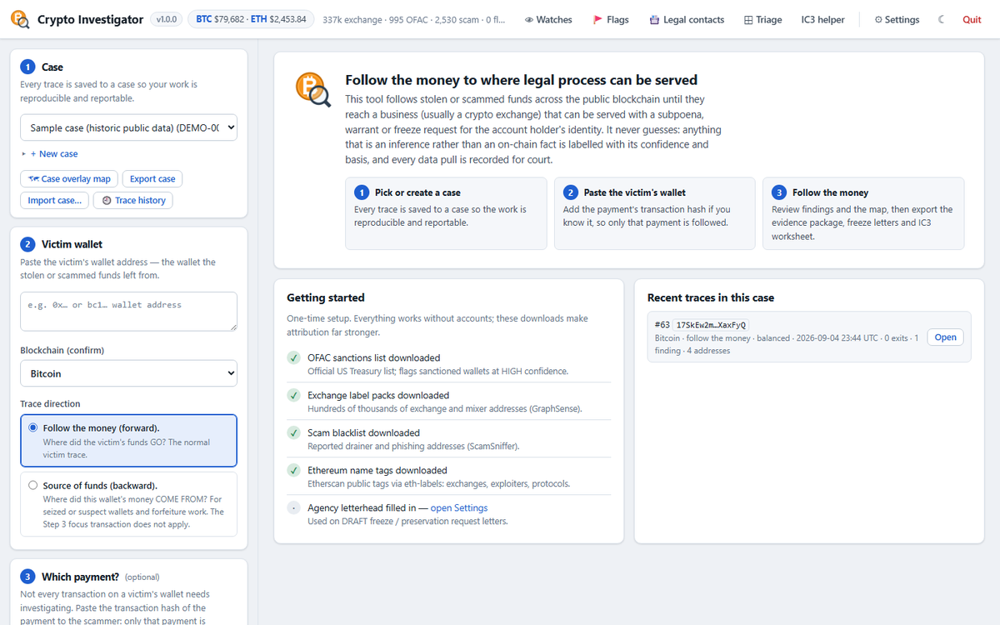
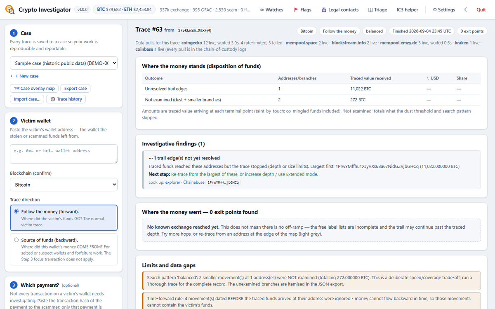
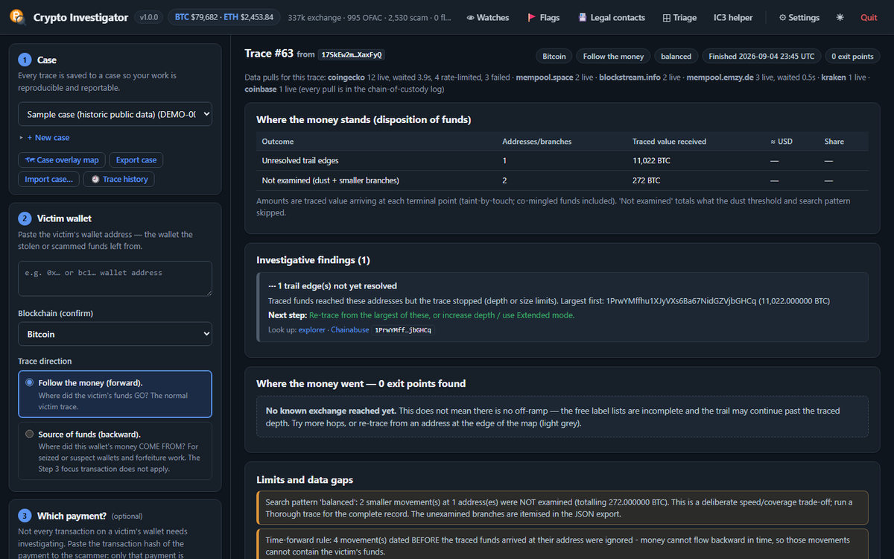

# Crypto Investigator

**Free, local, court-minded cryptocurrency tracing for law-enforcement
investigators.** Follow a victim's funds across Bitcoin, Ethereum (incl.
USDT/USDC) and Tron (incl. TRC-20 USDT) until they reach a custodian that
can be served with legal process — then generate the report, the
chain-of-custody log, the freeze letter and the IC3 worksheet.

- **No accounts required.** Every chain and USD pricing work out of the
  box on free public APIs. Optional keys only raise rate limits.
- **Runs entirely on the workstation.** Localhost only, no telemetry, no
  cloud. Case data never leaves the machine.
- **Built for court.** Every data pull is logged with URL, UTC time and
  SHA-256. Every inference carries a confidence and its basis. Dead ends
  are reported, never bridged by guesswork.
- **$0.** The commercial tools cost $50k–$700k a year; this is the
  triage-to-court tier small agencies are priced out of.

> **This tool does not identify people.** It identifies *where legal
> process can be served*. The account holder's identity comes from the
> custodian's KYC records via that process.



## What it does

| | |
|---|---|
| **Trace** | Forward (follow the money) or backward (source of funds); focus on one payment; Rapid / Balanced / Thorough search patterns; extended mode until every branch resolves; honest accounting of everything skipped. |
| **Find** | Ranked investigative findings: named exchange reached, funds at rest, probable exchange deposit, sanctioned or mixer contact, agency and partner flags, public scam reports, Bitcoin address clusters. |
| **Attribute** | OFAC SDN (official), GraphSense TagPacks (~337k), Etherscan tags via eth-labels (~87k), ScamSniffer, on-demand Chainabuse lookups, the agency's own flags, and partner agencies' flag packs — each with source and confidence. |
| **Package** | Court report PDF, chain-of-custody CSV, raw JSON, DRAFT affidavit methodology, per-exit traceroutes, DRAFT freeze/preservation letters (custodian or stablecoin issuer), evidence ZIP with SHA-256 manifest, print-resolution map image. |
| **Act** | Watch wallets for movement, flag fraudulent wallets across cases, bulk-triage hundreds of addresses, browse the custodian legal-process directory, fill the FBI IC3 worksheet. |
| **Share** | Case export/import between machines; flag packs between agencies. |
| **Optional AI** | Off by default. Claude, ChatGPT, or a local model; glass-box with a full audit log; output is assistance, never evidence. |



## Quick start

**Agencies:** run `CryptoInvestigator-Setup-v<version>.exe` from the
[latest release](https://github.com/wyattrossell/Crypto_Investigator/releases)
(no administrator rights needed), or unzip the portable build. Open
*Crypto Investigator* from the Start menu; the browser opens and a tray
icon shows it is running. Then, in **Settings**, press the four label
downloads once and fill in the agency letterhead. That's the whole setup.

**From source:**

```
python -m pip install -r requirements.txt
python run.py
```

Full instructions, network requirements, key options and troubleshooting:
**[docs/setup-guide.md](docs/setup-guide.md)** (for IT) and
**[docs/investigator-guide.md](docs/investigator-guide.md)** (for
investigators).

## Design rules (non-negotiable)

1. Heuristics are never presented as facts — every inference carries a
   confidence level and its basis.
2. Dead ends (mixers, bridges, privacy coins, smart contracts) are flagged
   honestly; the tool never fabricates continuity.
3. Every data pull is recorded in a chain-of-custody log (exact URL, UTC
   timestamp, SHA-256 of the raw response) so any analyst can reproduce it.
4. Public data only. Partner and third-party designations are always
   named as such.



## Data sources

Bitcoin: mempool.space / blockstream.info / mempool.emzy.de (keyless pool),
the Blockstream Explorer API (keyed), or your own node. Ethereum:
Blockscout and Routescan (keyless), Alchemy or Etherscan (free keys), or
your own Blockscout. Tron: TronGrid. Prices: CoinGecko → Kraken → Coinbase.
Labels: OFAC, GraphSense, eth-labels, ScamSniffer, Chainabuse. *Settings →
Data sources* shows tiers, limits, pricing links and live counters.

## Documentation

- [Setup guide](docs/setup-guide.md) · [Investigator's guide](docs/investigator-guide.md) · [Release checklist](docs/release-checklist.md)
- [`docs/validation/`](docs/validation/) — the **Technical Validation
  Document** (full methodology and verification procedures for outside
  experts and court) and a two-page **Overview**, regenerated for every
  version with `python tools/make_docs.py`.
- [`docs/listings/`](docs/listings/) — the complete program listing of
  every version, hashed in the validation document.
- [`CHANGELOG.md`](CHANGELOG.md) — what each release adds and its known
  limitations. [`docs/feature-roadmap.md`](docs/feature-roadmap.md) — what
  is next and what is deliberately not attempted.

## Building a release

```
python -m pip install -r requirements.txt -r requirements-build.txt
python tools/build_release.py      # PyInstaller build + portable zip (+ Setup.exe with Inno Setup 6)
```

## Project status

Version 1.0.0 — first release prepared for distribution to multiple
agencies. Windows 10/11 for the installed build; the source runs anywhere
Python 3.10+ does.
